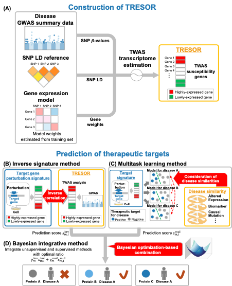
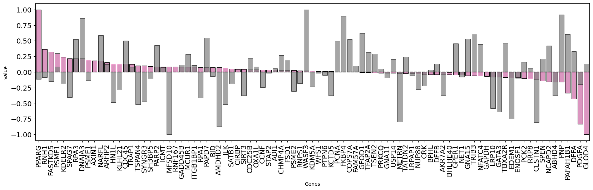

# Bayesian integrative method using TRESOR signatures

`Bayesian integrative method`  is a machine learning method for predicting therapeutic targets of various diseases 
    by Bayesian optimization-based combination of inverse signature and multitask learning methods using TRESOR. 
    



## Publication/Citation :link:

The study of `Bayesian integrative method` is described in the [manuscript](URL). 

```
Satoko Namba, Michio Iwata, Shin-Ichi Nureki, Noriko Yuyama Otani, and Yoshihiro Yamanishi. 
Therapeutic target prediction for orphan diseases integrating genome-wide and transcriptome-wide association studies.
Nature Communications, page number, 2025.
```

<br>


## Prerequisites :memo:

The software is developed and tested in Mac OS environment (Apple M1 MacBook Pro, Computer memory 64 GB, Sonoma 14.1.1).

The basic requirements for running TRESOR are [python>=3.10](https://www.python.org/) with the following packages:
- [python=3.10.6](https://www.python.org/)
- [pandas==2.1.3](https://pandas.pydata.org/)
- [numpy=1.26.4](https://numpy.org/)
- [gpyopt==1.2.6](https://sheffieldml.github.io/GPyOpt/)
- [scikit-learn==1.3.2](https://scikit-learn.org/stable/)
- [scipy==1.11.4](https://scipy.org/)
- [matplotlib==3.6.2](https://matplotlib.org/)
- [seaborn==0.13.0](https://seaborn.pydata.org/)

Datails on system requirements is contained in the following file: `__for_install__/environment.yaml`.

<br>


## Installation and conda environment setup :pick:

Just clone this repository.

```
git clone this-repo-url
cd /path/to/this/repo/src
```
<br>


A quick solution to install the basic requirments is using [Miniconda](https://docs.anaconda.com/miniconda/) and the file `__for_install__/environment.yaml` in this repository to create a working environment.
NOTE: Our software utilizes the python GPyOpt library, potentially leading to errors depending on user’s environment. Refer to the official [GPyOpt website](https://sheffieldml.github.io/GPyOpt/firststeps/index.html).

```
conda env create -f /path/to/this/repo/__for_install__/environment.yaml
conda activate tresor
```
<br>


## Downloading data :earth_asia:

Please download datasets required for this method from [here](https://yamanishi.cs.i.nagoya-u.ac.jp/tresor/), and put the downloaded `data` and `data_userdata` folders under the this repository.
Note that in the peer review step, the datasets have already been included in this repository.
```
mv /path/to/the/downloaded/data/folder /path/to/this/repo/
mv /path/to/the/downloaded/data_userdata/folder /path/to/this/repo/
```
<br>


## Usage of Bayesian integrative method with TRESOR (paper experiments) :technologist:

Here we introduce the usage of Bayesian integrative method with TRESOR signatures, reproducing the paper experiments. The usage include steps of (1) estimating optimal parameters and (2) newly predicting therapeutic targets with the parameters for 284 diseases with 4,345 inhibitory target candidates and 151 diseases with 4,040 activatory target candidates.


### 1. Estimate optimal weights for inverse signature and multitask learning methods :computer:

#### 1.1. Merge prediction scores of inverse signature and multitask learning methods.

First, you need to prepare merged data of prediction results from both methods toward Bayesian integrative method. Note that you need to download data before the following commands (see [Downloading data](#Downloading-data) section)<br>

If you want to predict inhibitory targets, run the command as follows.
```
./01_Sum_Inverse_Multitask.py \
--pert_type trt_sh.cgs \
--disease_set C0002736,C0002395 \
--out_file ../data/Bayesian/performance_evaluation/score_sum/trt_sh.cgs_select.txt
```

If you want to predict activatory targets, run the command as follows.
```
./01_Sum_Inverse_Multitask.py \
--pert_type trt_oe \
--disease_set C0002736,C0002395 \
--out_file ../data/Bayesian/performance_evaluation/score_sum/trt_oe_select.txt
```
<br>


The command line parameters mean:

- `--pert_type` Perturbation type (Thrapeutic target type). "trt_sh.cgs" means inhibitory target prediction, and "trt_oe" means activatory target prediction.
- `--disease_set` Diseases you want to predict. "all" means all available diseases. If you want to predict not all diseases but some diseases you are interested in (e.g., Multiple endocrine neoplasia and Alzheimer disease), you set comma-separated [disease UMLS IDs](https://doi.org/10.1093/nar/gkh061) (_Bodenreider, O._, _Nucleic Acids Ress_, **32**(Database issue), D267–D270, 2004) (e.g., "C0002736,C0002395"). All available diseases for inhibitory and activatory target predictions are provided in `data/LabelData/trt_sh.cgs/Union_GDA_AeBmCmGvPm_VDA_CmGv/disease_id_name.txt` and `data/LabelData/trt_sh.cgs/Union_GDA_AeBmCmGvPm_VDA_CmGv/disease_id_name.txt`, respectively.
- `--out_file` Path where results will be saved to.
<br>


Prediction socres are located in the following directories:
| Method type               | Therapeutic target type | Path |
|:--------------------------|:------------------------|------|
| Inverse signature method  | Inhibitory target       | data/Bayesian/performance_evaluation/inverse/trt_sh.cgs_prediction_score_label.txt |
| Inverse signature method  | Activatory target       | data/Bayesian/performance_evaluation/inverse/trt_oe_prediction_score_label.txt |
| Multitask learning method | Inhibitory target       | data/Bayesian/performance_evaluation/multitask/trt_sh.cgs_merge.txt |
| Multitask learning method | Activatory target       | data/Bayesian/performance_evaluation/multitask/trt_oe_merge.txt |

<br>


#### 1.2. Estimate oprimal weights for inverse signature and multitask learning methods by Bayesian optimization.

If you want to predict inhibitory targets, run the command as follows.
```
./02_bayesian_1on1.py \
--pert_type trt_sh.cgs \
--disease_set C0002736,C0002395 \
--input_file ../data/Bayesian/performance_evaluation/score_sum/trt_sh.cgs_select.txt \
--out_dir ../data/Bayesian/performance_evaluation/parameters_disease
```

If you want to predict activatory targets, run the command as follows.
```
./02_bayesian_1on1.py \
--pert_type trt_oe \
--disease_set C0002736,C0002395 \
--input_file ../data/Bayesian/performance_evaluation/score_sum/trt_oe_select.txt \
--out_dir ../data/Bayesian/performance_evaluation/parameters_disease
```

The command line parameters mean:

- `--pert_type` Perturbation type (Thrapeutic target type). "trt_sh.cgs" means inhibitory target prediction, and "trt_oe" means activatory target prediction.
- `--disease_set` Diseases you want to predict. "all" means all available diseases. If you want to predict not all diseases but some diseases you are interested in (e.g., Multiple endocrine neoplasia and Alzheimer disease), you set comma-separated [disease UMLS IDs](https://doi.org/10.1093/nar/gkh061) (_Bodenreider O._, _Nucleic Acids Ress_, **32**(Database issue), D267–D270, 2004) (e.g., "C0002736,C0002395"). All available diseases for inhibitory and activatory target predictions are provided in `data/LabelData/trt_sh.cgs/Union_GDA_AeBmCmGvPm_VDA_CmGv/disease_id_name.txt` and `data/LabelData/trt_sh.cgs/Union_GDA_AeBmCmGvPm_VDA_CmGv/disease_id_name.txt`, respectively.
- `--input_file` Path of merged prediction results, which are created in the step 1.1.
- `--out_dir` Directory path where results will be saved to.

<br>


##### Output files:

| File name | Description |
|:----------|:------------|
| opt.csv   | Estimated optimal weights for inverse signature and multitask learning methods.|
| bedauc_history_data.csv | History data of Bayesian optimization. |
| bedauc_convergenece.png | Visualization of history data. |
| Bayesianbedauc_label.txt | Prediction results with estimated weights. |


The output `opt.csv` is a comma-separated text file with the following columns:
- `tw_score` estimated weight for inverse signature method
- `GDA_Cm` estimated weight for multitask learning method
- `Y`  BED AUC value weith the estimated weights

<br>


### 2. New prediction of thrapeutic targets :rainbow:

Optimal weights already estimated for all diseases are located in the following directories:
- Inhibitory target predictions: `/data/Bayesian/new_prediction/pre_parameters/trt_sh.cgs.txt`
- Activatory target predictions: `/data/Bayesian/new_prediction/pre_parameters/trt_oe.txt`

If you want to predict inhibitory targets, run the command as follows.

```
./03_NewlyPrediction.py \
--pert_type trt_sh.cgs \
--disease_set C0002736,C0002395 \
--input_dir ../data/Bayesian/performance_evaluation/parameters_disease \
--out_dir ../data/Bayesian/new_prediction/output/trt_sh.cgs
```

If you want to predict activatory targets, run the command as follows.

```
./03_NewlyPrediction.py \
--pert_type trt_oe \
--disease_set C0002736,C0002395 \
--input_dir ../data/Bayesian/performance_evaluation/parameters_disease \
--out_dir ../data/Bayesian/new_prediction/output/trt_oe
```

The command line parameters mean:

- `--pert_type` Perturbation type (Thrapeutic target type). "trt_sh.cgs" means inhibitory target prediction, and "trt_oe" means activatory target prediction.
- `--disease_set` Diseases you want to predict. "all" means all available diseases. If you want to predict not all diseases but some diseases you are interested in (e.g., Multiple endocrine neoplasia and Alzheimer disease), you set comma-separated [disease UMLS IDs](https://doi.org/10.1093/nar/gkh061) (_Bodenreider O._, _Nucleic Acids Ress_, **32**(Database issue), D267–D270, 2004) (e.g., "C0002736,C0002395"). All available diseases for inhibitory and activatory target predictions are provided in `data/LabelData/trt_sh.cgs/Union_GDA_AeBmCmGvPm_VDA_CmGv/disease_id_name.txt` and `data/LabelData/trt_sh.cgs/Union_GDA_AeBmCmGvPm_VDA_CmGv/disease_id_name.txt`, respectively.
- `--input_dir` Directory path where estimated weights were saved to.
- `--out_dir` Directory path where results will be saved to.


##### Output files:

| File name | Description |
|:----------|:------------|
| parameters.txt | Merged file of estimated parameters across diseases |
| prediction_results.txt | New prediction of therapeutic targets with estimated parameters |

The output `prediction_results.txt` is a tab-separated text file with the following columns:
- `gene` candidate inhibitory/activatory targets.
- `disease` Unified Medical Language System (UMLS) disease ID.
- `inv_param` a parameter for inverse signature method.
- `mul_param` a parameter for multitask learning method.
- `prediction_score` a prediction score of candidate target for a disease.
- `diseaseName` disease name corresponding to UMLS disease ID.

<br>


## Usage of inverse signature method with user's own TWAS data :wrench:

In this section, we introduce how to predict new therapeutic targets by inverse signature method with user's own TWAS data. Additionally, we provide how to analyse mechanism of actions of predicted therapeutic target candidate for diseases. Note that you need to download data before the following steps (see [Downloading data](#Downloading-data) section)

### 1. Prepare TRESOR signatures :dna:
First, you need to format your twas data according to the following TRESOR format. In this study, we conducted TWAS analyses using [S-PrediXcan](https://github.com/hakyimlab/MetaXcan) with GWAS summary data preprocessed by [summary-gwas-imputation](https://github.com/hakyimlab/summary-gwas-imputation).

The input TWAS signatures are a tab-separated text file with the following columns:
- `zscore` zscores resulted from TWAS analyses.
- `disease_id` disease identifiers such as disease IDs or disease names.
- `tissue` tissue type used for TWAS analyses.
- `entrezgene` entrezgenes. You need to add "hsa:" before the entrezgene ID (e.g., hsa:51348).

The example data is provided in the `data_userdata/example/twas_C0027662_Thyroid.txt` file.

<br>


### 2. Inverse signature method with TRESOR signatures :abacus:

This step calculates inverse correlations between your own TRESOR signatures and target gene perturbed signatures. Here, original genetically perturbed signatures are used. Because target gene perturbation signatures have many missing entries, we recommend imputing these values using a [tensor decomposition algorithm](https://academic.oup.com/bioinformatics/article/35/14/i191/5529149) (Iwata _et al._, _Bioinformatics_, **35**, i191–i199, 2019).

If you want to predict inhibitory targets, run the command as follows.

```
cd src_userdata
./01_InverseCorrelation.py \
--pert_type trt_sh.cgs \
--cell_type MCF7 \
--twas_input ../data_userdata/example/twas_C0027662_Thyroid.txt \
--out_file ../data_userdata/output/trt_sh.cgs/C0027662_Thyroid_MCF7.txt \
--col_zscore zscore \
--col_disease_id disease_id \
--col_tissue tissue \
--col_entrezgene entrezgene
```

If you want to predict activatory targets, run the command as follows.

```
cd src_userdata
./01_InverseCorrelation.py \
--pert_type trt_oe \
--cell_type MCF7 \
--twas_input ../data_userdata/example/twas_C0027662_Thyroid.txt \
--out_file ../data_userdata/output/trt_oe/C0027662_Thyroid_MCF7.txt \
--col_zscore zscore \
--col_disease_id disease_id \
--col_tissue tissue \
--col_entrezgene entrezgene
```

The command line parameters mean:

- `--pert_type` Perturbation type (Thrapeutic target type). "trt_sh.cgs" means inhibitory target prediction, and "trt_oe" means activatory target prediction.
- `--twas_input` Filie path of TRESOR signatures.
- `--out_file` File path where results will be saved to.
- `--col_zscore` Column name including zscores calculated by TWAS analyses (default: zscore).
- `--col_disease_id` Column name of disease identifier. If you include multiple disease identifiers, inverse signature method is conducted for each disease identifier (default: disease_id).
- `--col_tissue` Column name of tissues. If you include multiple tissues, inverse signature method will be conducted for each tissue (default: tissue).
- `--col_entrezgene` Column name of entrezgenes (default: entrezgene).
- `--cell_type` cell type of genetically perturbed signatures (i.e., cell type of therapeutic target candidates). You can choose the cell types from the following cell types. If you set "all", inverse signature method is conducted across all cell types.

| Therapeutic target type | Available cell types |
|:----------|:------------|
| Inhibitory target | [A375](https://www.cellosaurus.org/CVCL_0132), [A549](https://www.cellosaurus.org/CVCL_0023), ASC, [HA1E](https://www.cellosaurus.org/CVCL_VU89), [HCC515](https://www.cellosaurus.org/CVCL_5136), [HEK293T](https://www.cellosaurus.org/CVCL_0063), [HEKTE](https://www.cellosaurus.org/CVCL_WS59), HEPG2, [HT29](https://www.cellosaurus.org/CVCL_0320), [MCF7](https://www.cellosaurus.org/CVCL_0031), [NCIH716](https://www.cellosaurus.org/CVCL_1581), NPC, [PC3](https://www.cellosaurus.org/CVCL_E2RM), [SHSY5Y](https://www.cellosaurus.org/CVCL_0019), SKL, [SW480](https://www.cellosaurus.org/CVCL_0546), [VCAP](https://www.cellosaurus.org/CVCL_2235) |
| Activatory target | 293T, [A375](https://www.cellosaurus.org/CVCL_0132), [A549](https://www.cellosaurus.org/CVCL_0023), AALE, H1299, [HA1E](https://www.cellosaurus.org/CVCL_VU89), [HCC515](https://www.cellosaurus.org/CVCL_5136), [HEK293](https://www.cellosaurus.org/CVCL_0045), [HEK293T](https://www.cellosaurus.org/CVCL_0063), [HELA](https://www.cellosaurus.org/CVCL_0030), HEPG2, [HT29](https://www.cellosaurus.org/CVCL_0320), [HUH7](https://www.cellosaurus.org/CVCL_0336), LHSAR, [LNCAP](https://www.cellosaurus.org/CVCL_0395), [MCF7](https://www.cellosaurus.org/CVCL_0031), [PC3](https://www.cellosaurus.org/CVCL_E2RM), RWPE, [SALE](https://www.cellosaurus.org/CVCL_WS60), [U2OS](https://www.cellosaurus.org/CVCL_0042), [VCAP](https://www.cellosaurus.org/CVCL_2235) |


The output file is a tab-separated text file with the following columns:
- `gene` therapeutic target candidate.
- `disease_id` disease identifier included in your TRESOR signatures.
- `correlation` pearson's correlation coefficient between target gene perturbation signatures and TRESORs.
- `tissue` tissue type of TWAS analysis.
- `cell` cell type of target gene perturbed signatures.
- `score` prediction scores of inverse signature method.
- `prediction_rank` prediction rank based on prediction scores.

<br>


### 3. (optional) Visualize mechanism of actions of predicted therapeutic targets :bar_chart:

You can visualize mechanism of actions of predicted therapeutic targets using your own TRESOR signatures and target gene perturbed signatures.

For example, if you want to focuse on Multiple endocrine neoplasia (MEN, C0027662) and predicted inhibitory targets (FHL2 and BECN1), run the command as follows.

```
cd src_userdata
./02_Visualization_InverseCorrelation.py \
--pert_type trt_sh.cgs \
--cell_type MCF7 \
--tissue_type Thyroid \
--foc_d C0027662 \
--foc_p FHL2,BECN1 \
--twas_input ../data_userdata/example/twas_C0027662_Thyroid.txt \
--out_dir ../data_userdata/output/trt_sh.cgs/bar_plot \
--col_zscore zscore \
--col_disease_id disease_id \
--col_tissue tissue \
--col_entrezgene entrezgene
```

The command line parameters mean:

- `--pert_type` Perturbation type (Thrapeutic target type). "trt_sh.cgs" means inhibitory target prediction, and "trt_oe" means activatory target prediction.
- `--cell_type` cell type of genetically perturbed signatures (i.e., cell type of therapeutic target candidates). You can choose the cell types from the table in the [step 2 subsection](#2.-Inverse-signature-method-with-TRESOR-signatures.). If you set "all", inverse signature method is conducted across all cell types.
- `--tissue_type` tissue type of TRESOR signature.
- `--foc_d` disease identifier that is included in your TRESOR signatures and you are interested in (e.g., C0027662).
- `--foc_p` comma-separated protein names (therapeutic target candidate names) that you are interested in (e.g., FHL2,BECN1).
- `--twas_input` Filie path of TRESOR signatures.
- `--out_dir` Directory path where results will be saved to.
- `--col_zscore` Column name including zscores calculated by TWAS analyses (default: zscore).
- `--col_disease_id` Column name of disease identifier. If you include multiple disease identifiers, inverse signature method is conducted for each disease identifier (default: disease_id).
- `--col_tissue` Column name of tissues. If you include multiple tissues, inverse signature method will be conducted for each tissue (default: tissue).
- `--col_entrezgene` Column name of entrezgenes (default: entrezgene).


Output figure of MEN and FHL2 is as follows:


This figure shows distributions of gene expression scores of TRESOR and knockdown of FHL2, predicted inhibitory target candidate for MEN. The horizontal axis represents common genes between TRESOR and gene knockdown signatures. The vertical axis represents gene expression scores. Pink and gray bars represent TRESOR and target gene knockdown signatures, respectively. Oppositely expressed genes between them are expected to be associated with therapeutic mechanism.

<br>


## License :notebook_with_decorative_cover:

This project is licensed under the LICENSE - see the [LICENSE](https://github.com/YamanishiLab/TRESOR/blob/main/LICENSE) file for details.

LICENSING TERMS:
This program is free of charge for academic research and education purposes.
However you must obtain a license from the author to use it for commercial purposes.
Commercial companies are prohibited from using this code or any part of it.
Even if you are an academic researcher, you are prohibited from using this code or any part of it in collaborative research with commercial companies.
The software must not be distributed without prior permission of the author.

<br>


## Contact :envelope_with_arrow:

For any question, you can contact corresponding author ([mail-address](mailto:yamanishi@i.nagoya-u.ac.jp))
<br>


## Acknowledgements :white_heart:

We sincerely thank the authors of following open-source projects:

- [S-PrediXcan](https://github.com/hakyimlab/MetaXcan)
- [summary-gwas-imputation](https://github.com/hakyimlab/summary-gwas-imputation)
<br>
